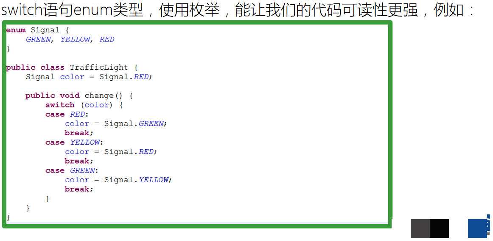

# 第13天 常用类、集合

## 主要内容

1、掌握Random常用API的使用

2、掌握Enum常用API的使用

3、掌握Arrays工具类的使用

4、掌握Collection工具类常用API的使用

5、掌握主要容器概述

## 学习目标

| 节数    | 知识点                            | 要求 |
|---------|-----------------------------------|------|
| 第一节  | 掌握Random常用API的使用           | 掌握 |
| 第二节  | 掌握Enum常用API的使用             | 掌握 |
| 第三节  | 掌握Arrays工具类的使用            | 掌握 |
| 第四节  | 掌握Collection工具类常用API的使用 | 掌握 |
| 第五节  | 掌握主要容器概述                  | 掌握 |

## 掌握Random常用API的使用

### 1.1创建方式

Math类中的random方法可以产生随机数，上节演示过。然而，该方法只能生成[0.0,1.0)范围的double值；很多时候，可能需要生成不同类型不同范围的随机值；

java.util包中的Random类可以用来生成不同类型的随机值，功能更为强大；

Random类创建对象两种方式：

| **方法声明**       | **方法描述**                                                                 |
|--------------------|------------------------------------------------------------------------------|
| Random()           | 创建Random对象，该对象每次生成的随机数不同                                   |
| Random(long seed)  | 使用一个种子参数创建Random对象，参数相同的Random对象，每次生成的随机数相同。 |

### 1.2 UUID

UUID是通用唯一识别码 (Universally Unique Identifier)的缩写，是唯一的机器生成的标识符；

UUID都不能是人工生成的，这样风险太高；

UUID是16字节128位长的数字，通常以36字节的字符串表示，示例如下：3F2504E0-4F89-11D3-9A0C-0305E82C3301

通常在分布式系统中用来生成唯一ID

UUID具有多个版本，每个版本的算法不同；

UUID Version 1：基于时间的UUID

通过计算当前时间戳、随机数和机器MAC地址得到。

UUID Version 2：DCE安全的UUID

和基于时间的UUID算法相同，但会把时间戳的前4位置换为POSIX的UID或GID。这个版本的UUID在实际中较少用到。

UUID Version 3：基于名字的UUID（MD5）

通过计算名字和名字空间的MD5散列值得到。

UUID Version 4：随机UUID

根据随机数，或者伪随机数生成UUID。

UUID Version 5：基于名字的UUID（SHA1）

和版本3的UUID算法类似，只是散列值计算使用SHA1（Secure Hash Algorithm 1）算法。

Java中对UUID的生成提供了支持，java.util.UUID 类定义了生成UUID的方法；

public static void main(String[] args) {

for(int i=0;i\<10;i++){

UUID uuid=UUID.randomUUID();

System.out.println(uuid);

}

}

## 掌握Enum常用API的使用

### 2.1枚举的声明使用及枚举元素与接口静态成员相比的优势作用

定义常规的静态常量后使用存在的一些小问题：

代码可读性差、易用性低。由于test方法的返回值代表类型，但却是int型的，在阅读代码的时候往往会感到一头雾水，根本不明白这个数值到底是什么意思，代表的是什么类型

类型不安全。在用户去调用的时候，必须保证类型完全一致，同时取值范围也要正确。像是对某些对象的类型属性进行赋值时，-1等非法的值满足类型要求，但却不存在与离散值列表之中，会出现较多的问题

耦合性高，扩展性差。例如，假如针对类别做了一个有效性验证，如果类别增加了或者有所变动，则有效性验证也需要做对应的修改，不利于后期维护

枚举就是为了这样的问题而诞生的。它们给出了将一个任意项同另一个项相比较的能力，并且可以在一个已定义项列表中进行迭代

枚举（在Jave中简称为Enum）是一个特定类型的类。所有枚举都是Java中的新类java.lang.Enum的隐式子类。此类不能手工进行子类定义

### 2.2枚举对象的方法与构造方法

所有的枚举都继承自java.lang.Enum类。由于Java 不支持多继承，所以枚举对象不能再继承其他类

枚举可以实现接口

不能有public的构造函数，这样做可以保证客户代码没有办法新建一个enum的实例。

所有枚举值都是public , static , final的。注意这一点只是针对于枚举值，我们可以和在普通类里面定义 变量一样定义其它任何类型的非枚举变量，这些变量可以用任何你想用的修饰符。

Enum默认实现了java.lang.Comparable接口。

Enum覆载了了toString方法

Enum提供了一个valueOf方法，这个方法和toString方法是相对应的

Enum还提供了values方法，这个方法使你能够方便的遍历所有的枚举值

Enum还有一个oridinal的方法，这个方法返回枚举值在枚举类种的顺序，这个顺序根据枚举值声明的顺序而定

## 第三节 掌握Arrays工具类的使用

Arrays类是JDK提供的专门用于操作数组的工具类，位于java.util包中。

用Arrays类的方法操作数组，无需自己编码。

Arrays类的常用方法：

1、boolean equals(array1,array2)：比较两个数组是否相等。

/\*\*

\* 数组比较

\*/

public static void arrayEquals() {

String[] a = {"1", "2", "3"};

String[] b = {"1", "2"};

System.out.println(Arrays.equals(a, b));

}

2、void sort(array)：对数组array的元素进行升序排列。

/\*\*

\* 数组排序

\*/

public static void arraySort() {

String[] a = {"1", "5", "3", "4"};

//把一个数组按照从小到大排序

Arrays.sort(a);

//通过Arrays工具类，把Array转化为String

System.out.println(Arrays.toString(a));

}

3、String toString(array)：把数组array转换成一个字符串。

/\*\*

\* 数组转换成字符串

\*/

public static void arrayToString() {

String[] a = {"1", "5", "3", "4"};

//通过Arrays工具类，把Array转化为String

System.out.println(Arrays.toString(a));

}

4、void fill(array,val)：把数组array所有元素都赋值为val。

/\*\*

\* 替换数组的值

\*/

public static void arrayFill() {

int[] a = {1, 2, 1, 2};

//param1:目标对象 param2:替换值（全局）

Arrays.fill(a, 6);

System.out.println(Arrays.toString(a));

}

5、int binarySearch(array,val)：查询元素值val在数组array中的下标

/\*\*

\* binarySearch：

\* 通过二分法的方式查找对应的元素下标

\*/

public static void arrayBinary(){

char[] a = {'1', '5', '3', '4'};

//使用索引查找下标必须排序

Arrays.sort(a);

System.out.println(a);

System.out.println(Arrays.binarySearch(a,'3'));

}

6、copyof(array,length)：把数组array复制成一个长度为length的新数组。

/\*\*

\* 数组的复制

\*/

public static void arrayCopyOf() {

int[] a = {1, 5, 3, 4};

//param1:原数组 param2:原数组长度

int[] b = Arrays.copyOf(a, a.length);

System.out.println(a.hashCode()+"\*\*\*\*"+b.hashCode());

System.out.println(Arrays.toString(b));

}

## 第四节 掌握Collection工具类常用API的使用

### 4.1对象集合排序

### 4.2线程安全的集合版本

集合框架中的新工具大多是非同步的，如果在并发环境中直接访问可能会导致各种问题，而Vector、Hashtable等老旧工具还继续保留的主要原因是维持向下兼容，因此我们希望能够获取新的集合工具的线程安全版本，而Collections工具类则为我们提供了这方面的支持

java.util.Collection 是一个集合接口。它提供了对集合对象进行基本操作的通用接口方法。Collection接口在Java 类库中有很多具体的实现Collection接口的意义是为各种具体的集合提供了最大化的统一操作方式。Collections是针对集合类的一个帮助类，他提供一系列静态方法实现对各种集合的搜索、排序、线程安全化等操作

Array类提供了动态创建和访问 Java 数组的方法

Arrays包含用来操作数组（比如排序和搜索）的各种方法。此类还包含一个允许将数组作为列表来查看的静态工厂

## 第五节 掌握主要容器概述

### 5.1什么是集合

集合框架：用于存储数据的容器。

集合框架是为表示和操作集合而规定的一种统一的标准的体系结构。  
任何集合框架都包含三大块内容：对外的接口、接口的实现和对集合运算的算法。

接口：表示集合的抽象数据类型。接口允许我们操作集合时不必关注具体实现，从而达到“多态”。在面向对象编程语言中，接口通常用来形成规范。

实现：集合接口的具体实现，是重用性很高的数据结构。

算法：在一个实现了某个集合框架中的接口的对象身上完成某种有用的计算的方法，例如查找、排序等。这些算法通常是多态的，因为相同的方法可以在同一个接口被多个类实现时有不同的表现。事实上，算法是可复用的函数。  
它减少了程序设计的辛劳。

集合框架通过提供有用的数据结构和算法使你能集中注意力于你的程序的重要部分上，而不是为了让程序能正常运转而将注意力于低层设计上。  
通过这些在无关API之间的简易的互用性，使你免除了为改编对象或转换代码以便联合这些API而去写大量的代码。 它提高了程序速度和质量。

### 5.2集合的特点

集合的特点主要有如下两点：

对象封装数据，对象多了也需要存储。集合用于存储对象。

对象的个数确定可以使用数组，对象的个数不确定的可以用集合。因为集合是可变长度的。

### 5.3集合和数组的区别

数组是固定长度的；集合可变长度的。

数组可以存储基本数据类型，也可以存储引用数据类型；集合只能存储引用数据类型。

数组存储的元素必须是同一个数据类型；集合存储的对象可以是不同数据类型。

数据结构：就是容器中存储数据的方式。

对于集合容器，有很多种。因为每一个容器的自身特点不同，其实原理在于每个容器的内部数据结构不同。

集合容器在不断向上抽取过程中，出现了集合体系。在使用一个体系的原则：参阅顶层内容。建立底层对象。

### 5.4使用集合框架的好处

容量自增长；

提供了高性能的数据结构和算法，使编码更轻松，提高了程序速度和质量；

允许不同 API 之间的互操作，API之间可以来回传递集合；

可以方便地扩展或改写集合，提高代码复用性和可操作性。

通过使用JDK自带的集合类，可以降低代码维护和学习新API成本。

### 5.5常用的集合类有哪些？

Map接口和Collection接口是所有集合框架的父接口：

Collection接口的子接口包括：Set接口和List接口

Map接口的实现类主要有：HashMap、TreeMap、Hashtable、ConcurrentHashMap以及Properties等

Set接口的实现类主要有：HashSet、TreeSet、LinkedHashSet等

List接口的实现类主要有：ArrayList、LinkedList、Stack以及Vector等
