**第十八天 多线程**

**主要内容**

1、掌握多线程概述

2、掌握线程的生命周期

3、掌握线程的创建和启动

4、掌握线程的调度与控制

5、掌握线程的同步

**学习目标**

| 节数   | 知识点               | 要求 |
|--------|----------------------|------|
| 第一节 | 掌握多线程概述       | 掌握 |
| 第二节 | 掌握线程的生命周期   | 掌握 |
| 第三节 | 掌握线程的创建和启动 | 掌握 |
| 第四节 | 掌握线程的调度与控制 | 掌握 |
| 第五节 | 掌握线程的同步       | 掌握 |

1.  **掌握多线程概述**

### 多线程介绍

线程是操作系统能够进行运算调度的最小单位；它被包含在进程之中，是进程中的实际运作单位。多线程，是指从软件或者硬件上实现多个线程并发执行的技术。具有多线程能力的计算机因有硬件支持而能够在同一时间执行多于一个线程，进而提升整体处理性能。简单来说：线程是程序中一个单一的顺序控制流程；而多线程就是在单个程序中同时运行多个线程来完成不同的工作。多线程是为了同步完成多项任务，不是为了提高运行效率，而是为了提高资源使用效率来提高系统的效率。多线程是在同一时间需要完成多项任务的时候实现的。

1.  **掌握线程的生命周期**

**Java中线程几种状态**

新线程：

当利用new关键字创建线程对象实例后，它仅仅作为一个对象实例存在， JVM没有为其分配CPU时间片和其他线程运行资源

就绪状态：

在处于创建状态的线程中调用start方法将线程的状态转换为就绪状态。这时，线程已经得到除CPU时间之外的其它系统资源，只等JVM的线程调度器按照线程的优先级对该线程进行调度，从而使该线程拥有能够获得CPU时间片的机会

运行状态:

就绪态的线程获得cpu就进入运行态

等待/阻塞：

线程运行过程中被剥夺资源或者，等待某些事件就进入等待/阻塞状态， suspend()方法被调用 ， sleep()方法被调用，线程使用wait()来等待条件变量;线程处于I/O等待等，调用suspend方法将线程的状态转换为挂起状态。这时，线程将释放占用的所有资源，但是并不释放锁，所以容易引发死锁，直至应用程序调用resume方法恢复线程运行。等待事件结束或者得到足够的资源就进入就绪态

死亡状态：

当线程体运行结束或者调用线程对象的stop方法后线程将终止运行，由JVM收回线程占用的资源

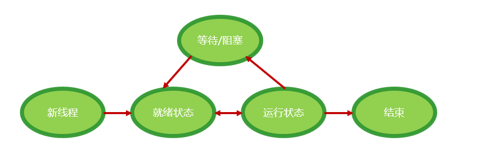

1.  **掌握线程的创建和启动**

### 使用Callable和Future创建线程

使用Callable创建线程和Runnable接口方式创建线程比较相似，不同的是，Callable接口提供了一个call() 方法作为线程执行体，而Runnable接口提供的是run()方法，同时，call()方法可以有返回值，而且需要用FutureTask类来包装Callable对象。

步骤：

1、创建Callable接口的实现类，实现call() 方法

2、创建Callable实现类实例，通过FutureTask类来包装Callable对象，  
 该对象封装了Callable对象的call()方法的返回值。

3、将创建的FutureTask对象作为target参数传入，创建Thread线程实例并启动新线程。

4、调用FutureTask对象的get方法获取返回值。

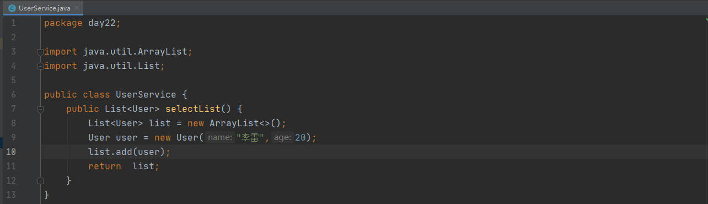

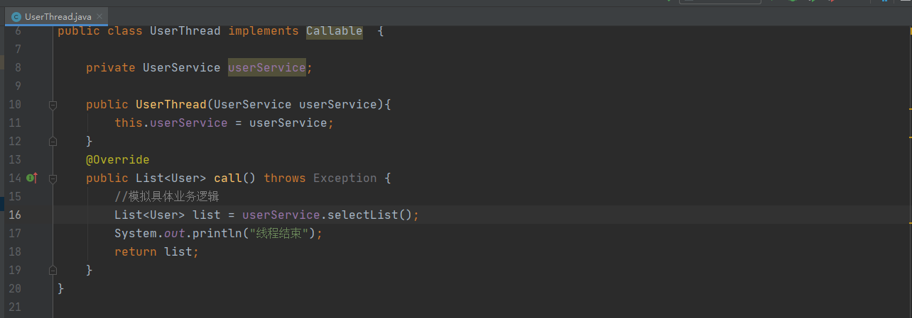

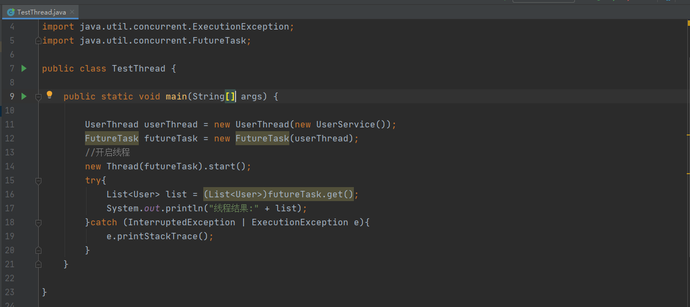

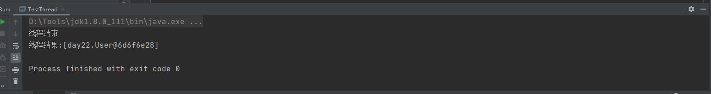

### 本节作业

1.  理解多线程的优点
2.  掌握线程创建的方法
1.  **掌握线程的调度与控制**

**线程的启停**

**启动**

执行start()方法，但是不能多次执行

****

**停止**

**线程的停止远比线程的启动情况复杂**

在Thread线程类中提供了stop()方法用于停止一个已经启动的线程，但是它已经被废弃，不建议使用，因为它本质上就是不安全的，它会解锁线程所有已经锁定的监视程序，在这个过程中会出现不确定性，导致这些监视程序监视的对象出现不一致的情况，或者引发死锁

**可以通过改变共享变量值的方法让run()方法执行结束**

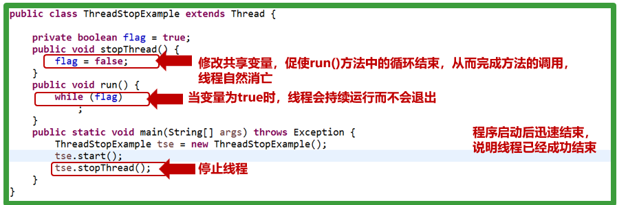

**处理阻塞情况**

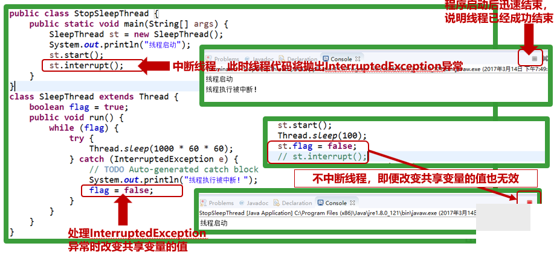

**处理IO阻塞情况—关闭IO即可**

### 本节作业

1.  掌握线程启停方法
2.  掌握线程阻塞解决方法
1.  **掌握线程的同步**

### 同步和异步的概念

后缀

### 3.2线程不同步带来的问题

### 3.2线程的方法

##### 3.2.1 同步块

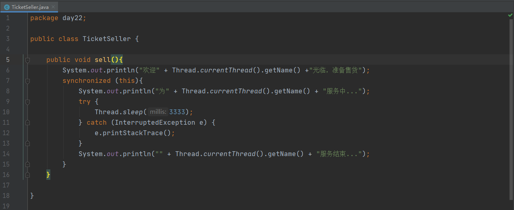

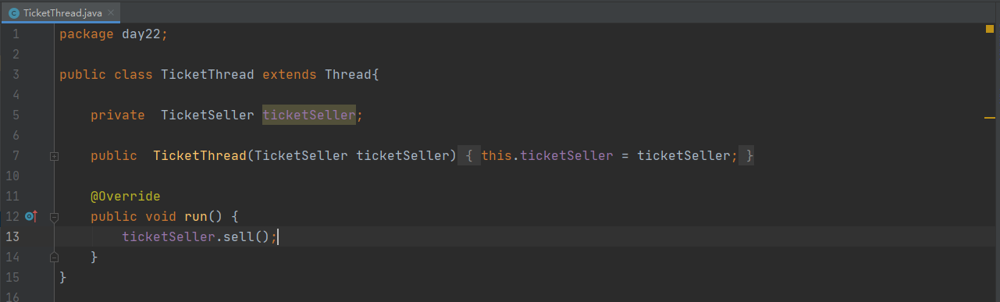

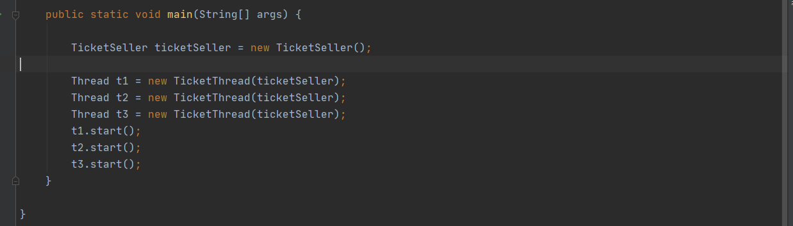

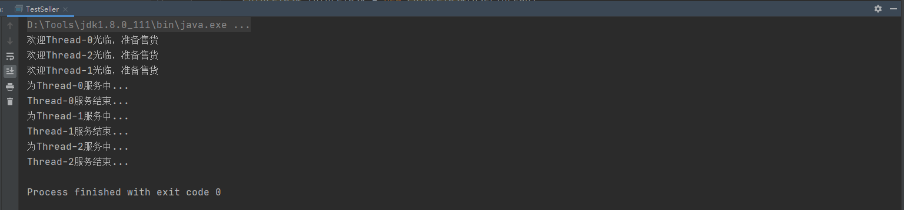

##### 3.2.2 同步方法

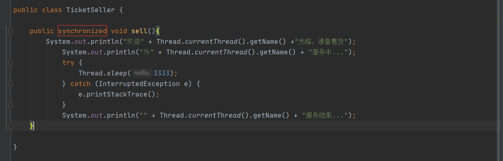

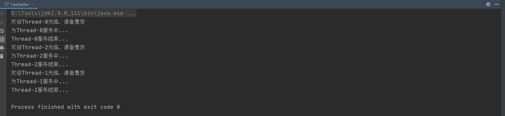

##### 3.2.3 Lock锁

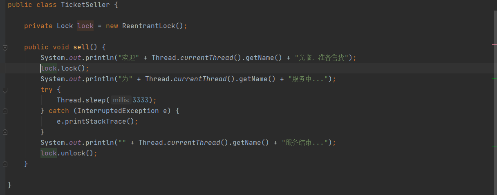

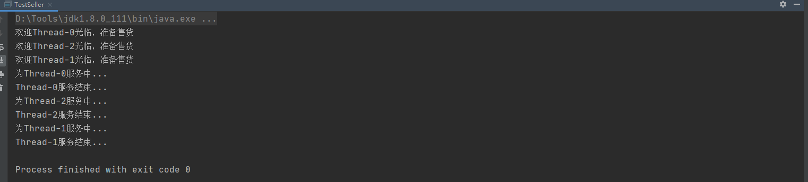

### 本节作业

1.  理解线程同步的优点
2.  理解线程不同步带来的问题
3.  掌握线程同步的方法
