# 第19天 多线程

## 主要内容

1、熟悉守护线程

2、熟悉Timer定时器的使用

3、掌握线程通信

4、掌握线程池

## 学习目标

| 节数   | 知识点                | 要求 |
|--------|-----------------------|------|
| 第一节 | 熟悉守护线程          | 掌握 |
| 第二节 | 熟悉Timer定时器的使用 | 掌握 |
| 第三节 | 掌握线程通信          | 掌握 |
| 第四节 | 掌握线程池            | 掌握 |

## 熟悉守护线程

### 守护线程特点

1）定义：守护线程--也称“服务线程”，在没有用户线程可服务时会自动离开。

2）优先级：守护线程的优先级比较低，用于为系统中的其它对象和线程提供服务。

3）设置：通过setDaemon(true)来设置线程为“守护线程”；将一个用户线程设置为守护线程的方式是在 线程对象创建 之前 用线程对象的setDaemon方法。

4）生命周期：守护进程（Daemon）是运行在后台的一种特殊进程。它独立于控制终端并且周期性地执行某种任务或等待处理某些发生的事件。也就是说守护线。

### 1.2 守护线程代码

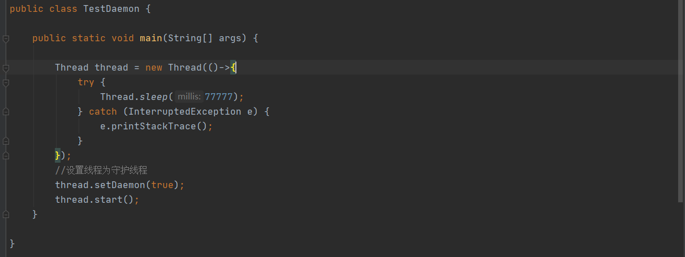

### 本节作业

1.  掌握守护线程特点
2.  掌握守护线程定义方法

## 熟悉Timer定时器的使用

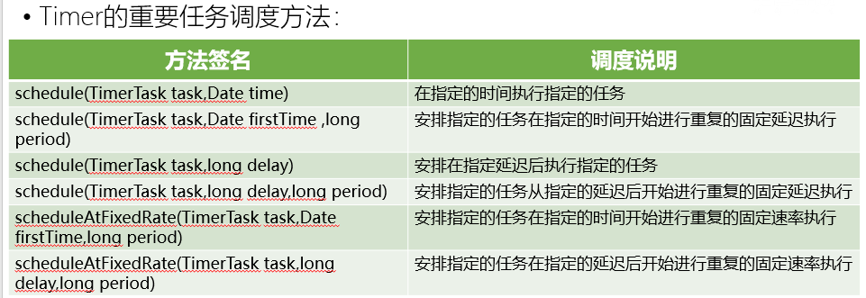

##### TimerTask

TimerTask是一个抽象类，和Runnable接口一样，通过一个run()抽象方法来定义任务执行的内容

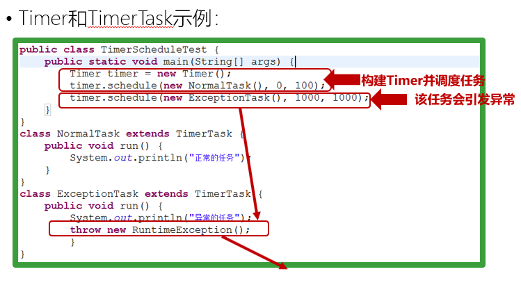

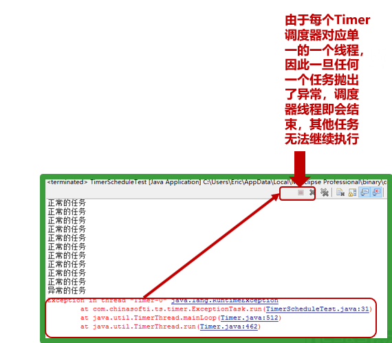

### 本节作业

1.  掌握定时器类方法
2.  编写闹钟定时器，在指定的时间执行闹钟

## 掌握线程通信

##### wait\\notify\\notifyAll

1、wait()、notify/notifyAll() 方法是Object的本地final方法，无法被重写。

2、wait()使当前线程阻塞，前提是必须先获得锁，一般配合synchronized 关键字使用，即，一般在synchronized 同步代码块里使用 wait()、notify/notifyAll() 方法。

3、 由于 wait()、notify/notifyAll() 在synchronized 代码块执行，说明当前线程一定是获取了锁的。当线程执行wait()方法时候，会释放当前的锁，然后让出CPU，进入等待状态。只有当 notify/notifyAll() 被执行时候，才会唤醒一个或多个正处于等待状态的线程，然后继续往下执行，直到执行完synchronized 代码块的代码或是中途遇到wait() ，再次释放锁。也就是说，notify/notifyAll() 的执行只是唤醒沉睡的线程，而不会立即释放锁，锁的释放要看代码块的具体执行情况。所以在编程中，尽量在使用了notify/notifyAll() 后立即退出临界区，以唤醒其他线程让其获得锁

4、wait() 需要被try catch包围，以便发生异常中断也可以使wait等待的线程唤醒。

5、notify 和wait 的顺序不能错，如果A线程先执行notify方法，B线程在执行wait方法，那么B线程是无法被唤醒的。

6、notify 和 notifyAll的区别

notify方法只唤醒一个等待（对象的）线程并使该线程开始执行。所以如果有多个线程等待一个对象，这个方法只会唤醒其中一个线程，选择哪个线程取决于操作系统对多线程管理的实现。notifyAll 会唤醒所有等待(对象的)线程，尽管哪一个线程将会第一个处理取决于操作系统的实现。如果当前情况下有多个线程需要被唤醒，推荐使用notifyAll 方法。比如在生产者-消费者里面的使用，每次都需要唤醒所有的消费者或是生产者，以判断程序是否可以继续往下执行。

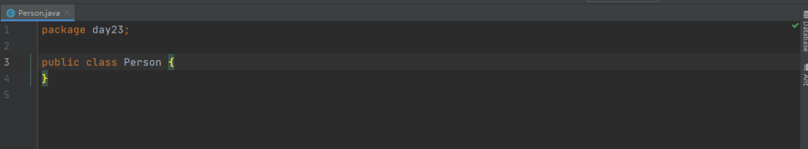

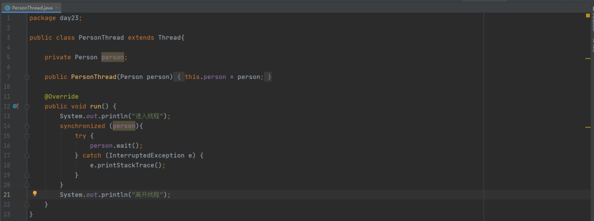

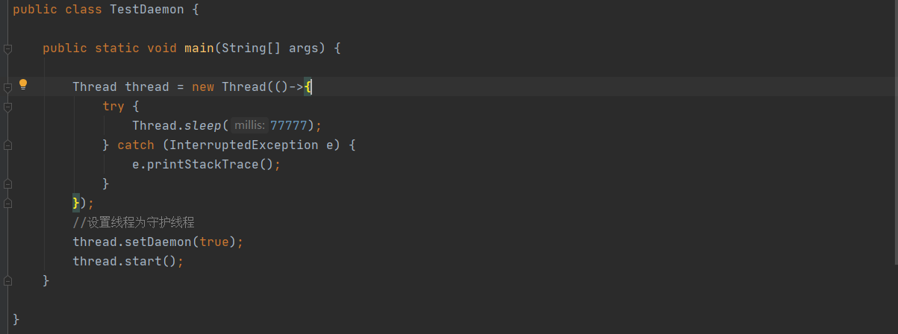

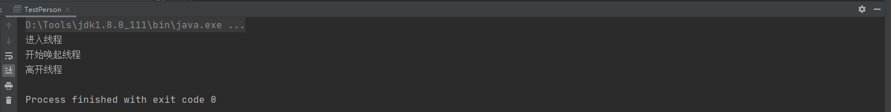

##### 管道流

Java中的Pipe管道输入流与Pipe管道输出流实现了类似管道的功能，用于不同线程之间的相互通信

### 本节作业

1.  掌握线程通信概念
2.  掌握线程通讯方法

## 掌握线程池

### 4.1为什么要使用线程池

当需要处理的任务较少时，我们可以自己创建线程去处理，但在高并发场景下，我们需要处理的任务数量很多，由于创建销毁线程开销很大，这样频繁创建线程就会大大降低系统的效率。

此时，我们就可以使用线程池，线程池中的线程执行完一个任务后可以复用，并不被销毁。合理使用线程池有以下几点好处：

1、减少资源的开销。通过复用线程，降低创建销毁线程造成的消耗。

2、多个线程并发执行任务，提高系统的响应速度。

3、可以统一的分配，调优和监控线程，提高线程的可管理性。

### 4.2线程池的创建

通过ThreadPoolExecutor来创建一个线程池。

创建方法：new ThreadPoolExecutor(corePoolSize, maximumPoolSize, keepAliveTime, milliseconds,runnableTaskQueue, threadFactory, handler);

java.uitl.concurrent.ThreadPoolExecutor类是线程池中最核心的一个类，它有四个构造方法。

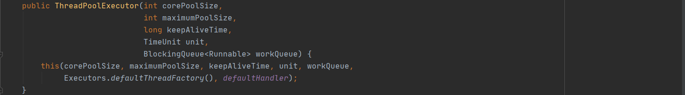

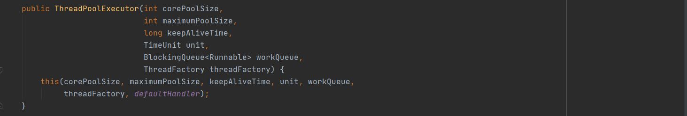

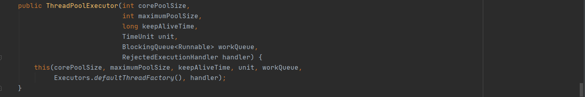

### 4.3向线程池提交任务

使用execute提交任务，但execute()方法没有返回值，无法判断任务是否被线程池执行成功。execute方法输入的任务是一个Runnable类的实例。

execute(new Runnable() {

@Override

public void run() {

// TODO Auto-generated method stub

}

});

使用submit()方法提交任务，会返回一个future,那么我们可以通过这个future来判断任务是否执行成功。

### 4.4线程池的关闭

调用shutdown()和shutdownNow()方法关闭线程池。

### 4.5 线程池的使用

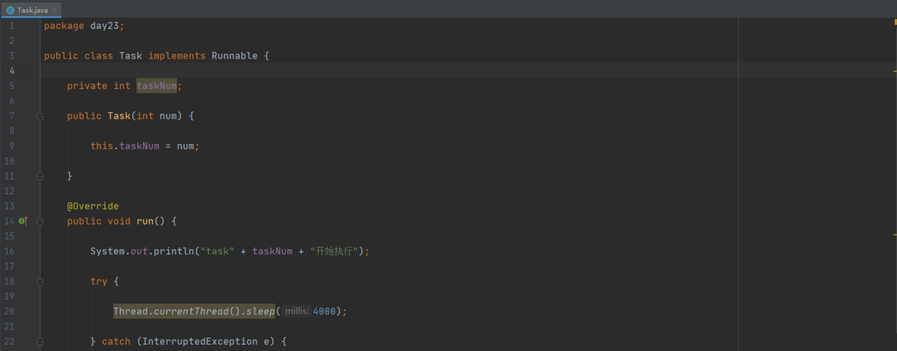

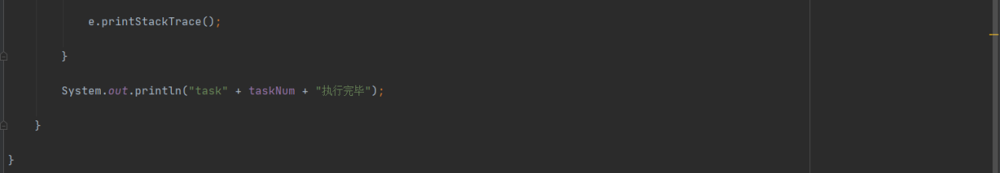

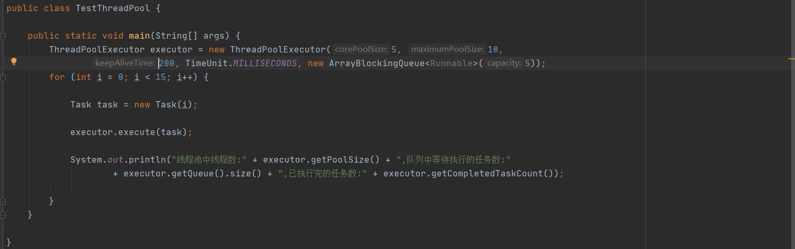

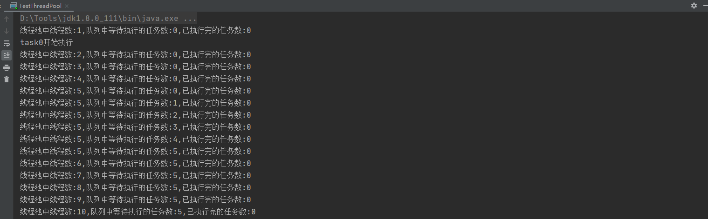

由执行结果可以看出，当线程池中线程的数目大于5时，便将任务放入任务缓存队列里面，当任务缓存队列满了之后，便创建新的线程，直到线程数等于最大线程数10后，便不再创建新线程。如果上面程序中，将for循环中改成执行20个任务，就会抛出任务拒绝异常了，因为最大线程10加上缓冲队列5，最多接受15个任务。

在java中，并不提倡直接使用ThreadPoolExecutor，而是使用Executors类中提供的几个静态方法来创建线程池，其内部也是调用ThreadPoolExecutor的构造方法，只不过参数已提前配置：

//corePoolSize设置为0，将maximumPoolSize设置为Integer.MAX_VALUE，使用的SynchronousQueue。

Executors.newCachedThreadPool();

//corePoolSize和maximumPoolSize都设置为1，使用的LinkedBlockingQueue

Executors.newSingleThreadExecutor();

//corePoolSize和maximumPoolSize值是相等的，使用的LinkedBlockingQueue

Executors.newFixedThreadPool(int);

实际开发中，如能满足要求，尽量使用这三个静态方法。如ThreadPoolExecutor达不到要求，可自己继承ThreadPoolExecutor类进行重写

### 本节作业

1.  掌握NIO概念
2.  掌握NIO和IO的区别
3.  编写程序实现NIO文件的复制
