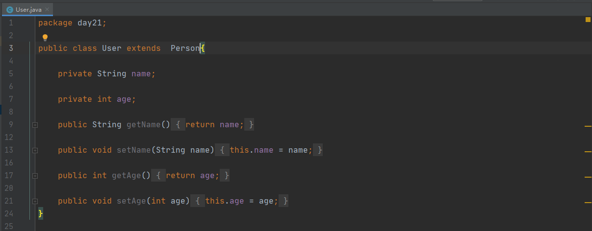
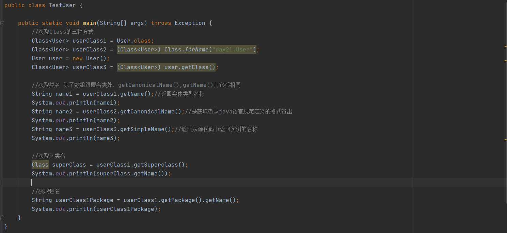
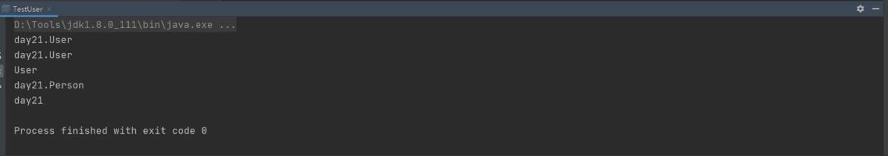
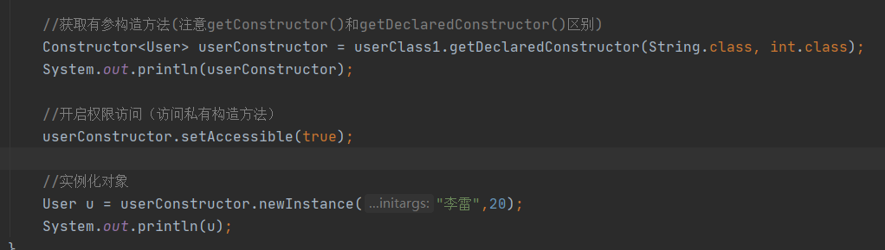
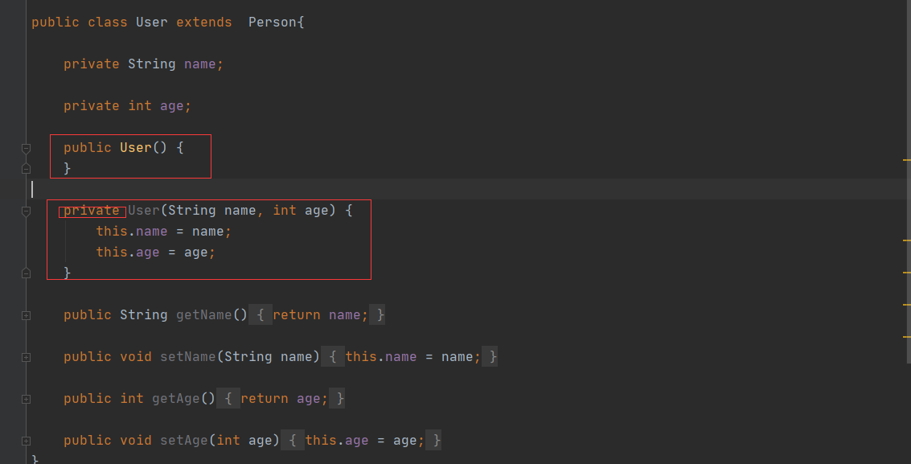
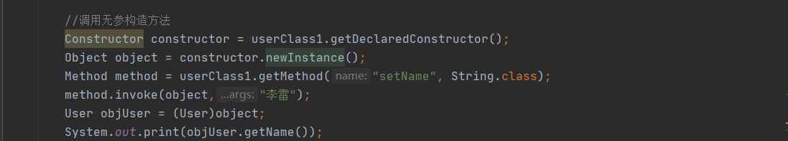
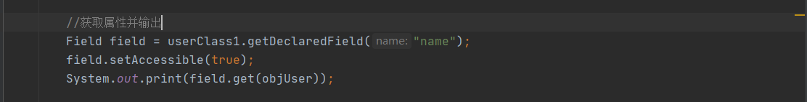
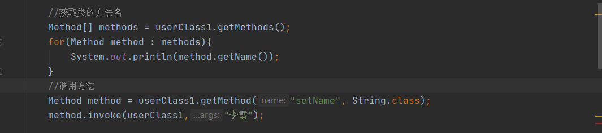
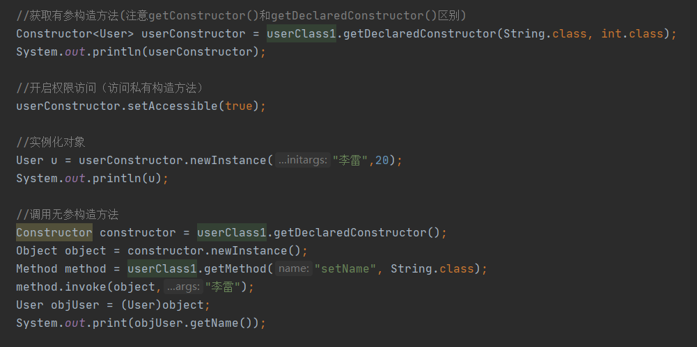

# 第20天 反射

## 主要内容

1、掌握反射概述

2、掌握Class类的使用

3、掌握Field类的使用

4、掌握Method类的使用

5、掌握Constructor类的使用

## 学习目标

| 节数   | 知识点                  | 要求 |
|--------|-------------------------|------|
| 第一节 | 掌握反射概述            | 掌握 |
| 第二节 | 掌握Class类的使用       | 掌握 |
| 第三节 | 掌握Field类的使用       | 掌握 |
| 第四节 | 掌握Method类的使用      | 掌握 |
| 第五节 | 掌握Constructor类的使用 | 掌握 |

## 掌握反射概述

### 反射的概念和作用

Java 反射机制是在运行状态中，对于任意一个类，都能够知道这个类的所有属性和方法；对于任意一个对象，都能够调用它的任意一个方法和属性；这种动态获取的信息以及动态调用对象的方法的功能称为Java语言的反射机制。实现Java反射机制的类都位于java.lang.reflect包中：

Class类：代表一个类

Field类：代表类的成员变量（类的属性）

Method类：代表类的方法

Constructor类：代表类的构造方法

Array类：提供了动态创建数组，以及访问数组的元素的静态方法

反射可以赋予jvm动态编译的能力，否则类的元数据信息只能用静态编译的方式实现

### 本节作业

1.  掌握反射的概念和作用

## 掌握Class类的使用

### 获取类名、父类名及包名

## 掌握Field类的使用

### 实例化对象

### 2.3调用对象方法

### 2.4获取属性

### 本节作业

1.  理解反射的作用
2.  掌握反射类的常用方法

## 掌握Method类的使用

### 本节作业

1.  理解Method的方法使用

2、可以调用某一个方法

## 第五节 掌握Constructor类的使用

### 本节作业

1.  掌握Constructor的方法使用
2.  
