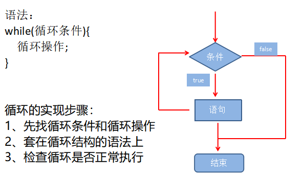
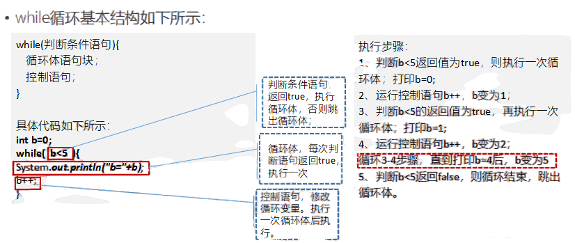
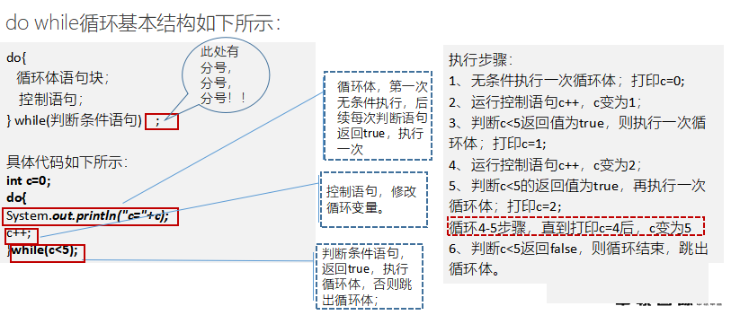
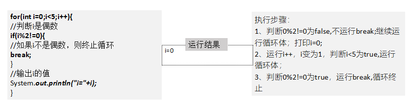
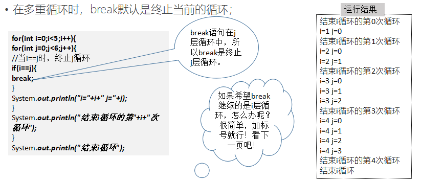
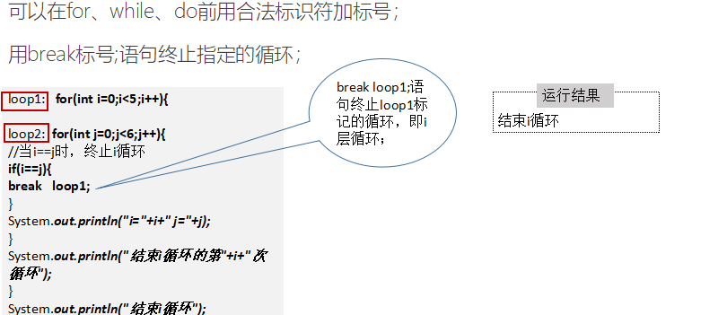
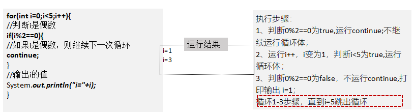
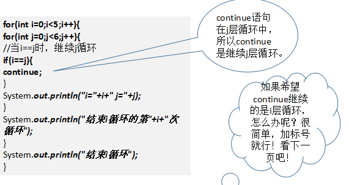
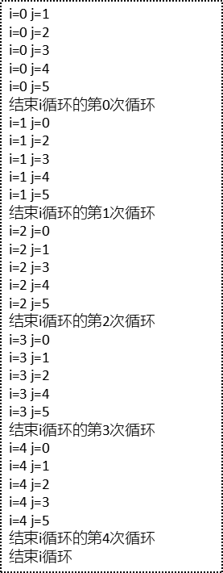
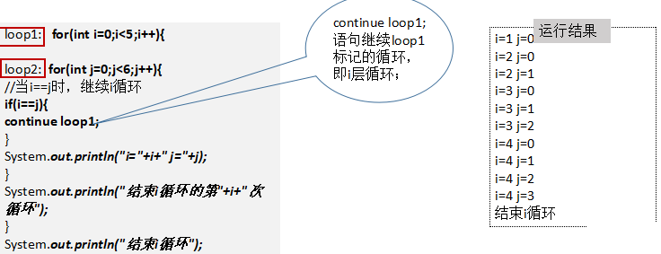

**第五天 流程控制**

**主要内容**

1、掌握循环语句-while语句

2、掌握循环语句-do while语句

3、掌握break语句的使用

4、掌握continue语句的使用

**学习目标**

| 节数    | 知识点                    | 要求 |
|---------|---------------------------|------|
| 第一节  | 掌握循环语句-while语句    | 掌握 |
| 第二节  | 掌握循环语句-do while语句 | 掌握 |
| 第三节  | 掌握break语句的使用       | 掌握 |
| 第四节  | 掌握continue语句的使用    | 掌握 |

1.  **掌握循环语句-while语句**

**1.1循环的概念，作用，while循环，死循环**

（1）循环是什么

在某些条件满足的情况下，反复执行特定代码的功能

（2）作用

循环语句：可以让一部分代码反复执行

（3）while循环

**案例1**

**案例2**

public class WhileLoop {

public static void main(String args[]){

int result = 0;

int i=1;

while(i\<=100) {

result += i;

i++;

}

System.out.println("result=" + result);

}

}

案例3

package com.example.lesson1;

public class Test {

public static void main(String args[]) {

int x = 10;

while (x \< 20) {

System.out.print("value of x :" + x);

x++;

System.out.print("\\n");

}

}

}

（4）死循环

死循环后面的代码将不会被执行，编译时系统报错，因为Java不允许有代码不被执行

//while形式死循环

While(true)

//for形式死循环

for( ; ; )

备注：死循环一般用于反复执行的一端代码之前 直到达到某个特定的条件终止死循环

1.  **掌握循环语句-do while语句**

**2.1**语法结构

案例

int c=0;

do{

System.out.println("c="+c);

c++;

}while(c\<5);

案例

public class Test {

public static void main(Staing args[]) {

int x = 10;

do {

System.out.print("value of x :" + x);

x++;

System.out.print("\\n");

} while (x \< 20);

}

}

备注：java中的增强for循环

Java5引入一种主要用于数组的增强型rot循环。

java增强for循环语法格式如下：

for(声明语句：表达式){

//代码句子

}

//声明语句：声明新的局部变量，该变量的类型必须和数组元素的类型匹配。其作用域限定在循环语句块

//其值与此时数组元素的值相等。

//表达式：表达式是要访问的数组名，或者是返回值为数组的方法。

//实例：

public class test {

public static void main(String args[]) {

int[] numbers = { 10, 20, 30, 40, 50 };

for (int x : numbers) {

System.out.print(x);

System.out.print(",");

}

System.out.print("\\n");

String[] names = { "James", "Larry", "Tom", "Lacy" };

for (String name : names) {

System.out.print(name);

System.out.print(",");

}

}

}

1.  **掌握break语句的使用**

**3.1 break**

在循环控制语句的循环体中，可以使用break语句，表示终止当前循环，跳出循环体；

示例一

下列代码打印输出0-4中的第一个偶数；

在多重循环时，break默认是终止当前的循环；

1.  **掌握continue语句的使用**

**4.1 continue**

在循环控制语句的循环体中，可以使用continue语句，表示不再继续循环体后面的代码，继续下一次循环；

下列代码打印输出0-4中的所有奇数；

在多重循环时，continue默认是继续当前的循环；

可以在for、while、do前用合法标识符加标号；

用continue 标号;语句继续指定的循环；

