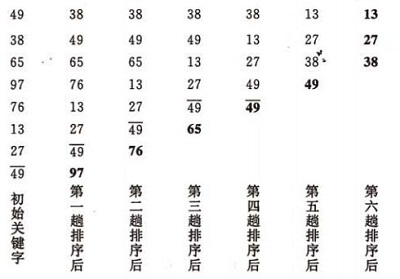
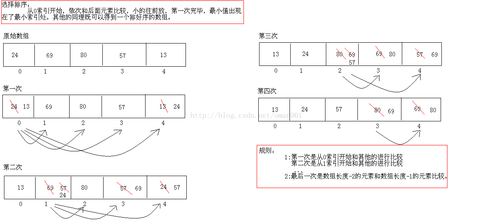
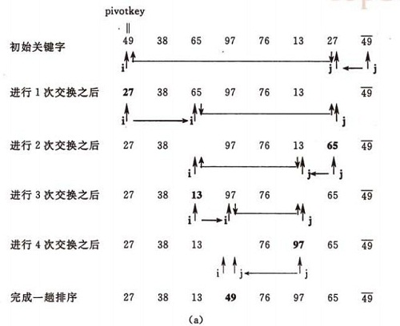
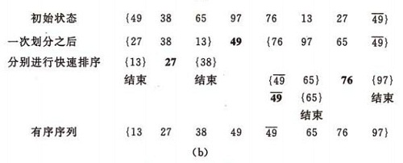

# 第7天 Java数组

# 主要内容

1、掌握数组的排序-冒泡排序

2、掌握数组的排序-选择排序

3、掌握数组的排序-快速排序

4、掌握数组的搜索-二分法（折半法）查找

| 节数   | 知识点                              | 要求 |
|--------|-------------------------------------|------|
| 第一节 | 掌握数组的排序-冒泡排序             | 掌握 |
| 第二节 | 掌握数组的排序-选择排序             | 掌握 |
| 第三节 | 掌握数组的排序-快速排序             | 掌握 |
| 第四节 | 掌握数组的搜索-二分法（折半法）查找 | 掌握 |

## 学习目标

## 掌握数组的排序-冒泡排序

冒泡排序

public class BubbleSort {

public static void bubbleSort(DataWrap[] data) {

System.out.println("开始排序");

int arrayLength = data.length;

for (int i = 0; i \< arrayLength - 1; i++) {

boolean flag = false;

for (int j = 0; j \< arrayLength - 1 - i; j++) {

if (data[j].compareTo(data[j + 1]) \> 0) {

DataWrap temp = data[j + 1];

data[j + 1] = data[j];

data[j] = temp;

flag = true;

}

}

System.out.println(java.util.Arrays.toString(data));

if (!flag)

break;

}

}

public static void main(String[] args) {

DataWrap[] data = { new DataWrap(9, ""), new DataWrap(-16, ""),

new DataWrap(21, "\*"), new DataWrap(23, ""),

new DataWrap(-30, ""), new DataWrap(-49, ""),

new DataWrap(21, ""), new DataWrap(30, "\*"),

new DataWrap(30, "")};

System.out.println("排序之前：\\n" + java.util.Arrays.toString(data));

bubbleSort(data);

System.out.println("排序之后：\\n" + java.util.Arrays.toString(data));

}

}

基本思想：

在要排序的一组数中，对当前还未排好序的范围内的全部数，自上而下对相邻的两个数依次进行比较和调整，让较大的数往下沉，较小的往上冒。即：每当两相邻的数比较后发现它们的排序与排序要求相反时，就将它们互换。

冒泡排序的示例：

## 掌握数组的排序-选择排序

Java数组排序的选择排序，是将最小索引的元素依次和后面元素进行比较，小的元素放到前面，第一次比较完毕后最小的元素就会在最左边最小索引出，后面同理即可得到一个排列好的数组

选择排序也是有规则的：

1 第一次是从0索引与后面的元素进行比较的，

第二次是从1索引和后面的元素比较的。。。

2 最后一次比较是数组的长度-2的索引元素和数组长度-1的索引元素比较

同样画图帮助理解一下

\---------------------------------------------------------------------------------------------------------------------------------------------------------------------------------------------------------------------------------------

\---------------------------------------------------------------------------------------------------------------------------------------------------------------------------------------------------------------------------------------

代码运行一下看结果

public class SelectDemo {

public static void main(String[] args) {

int[] arr = new int[] { 2, 34, 56, 43, 45 };

int[] arr2 = getSelect(arr);

for (int a : arr2) {

System.out.print(a + " ");

}

}

public static int[] getSelect(int[] arr2) {

for (int i = 0; i \< arr2.length - 1; i++) {

int minIndex = i;

for (int j = i + 1; j \< arr2.length; j++) {

if (arr2[minIndex] \> arr2[j]) {

minIndex = j;

}

}

if (arr2[minIndex] != arr2[i]) {

int temp = arr2[minIndex];

arr2[minIndex] = arr2[i];

arr2[i] = temp;

}

}

return arr2;

}

}

## 第三节 掌握数组的排序-快速排序

快速排序

public class QuickSort {

private static void swap(DataWrap[] data, int i, int j) {

DataWrap temp = data[i];

data[i] = data[j];

data[j] = temp;

}

private static void subSort(DataWrap[] data, int start, int end) {

if (start \< end) {

DataWrap base = data[start];

int i = start;

int j = end + 1;

while (true) {

while (i \< end && data[++i].compareTo(base) \<= 0)

;

while (j \> start && data[--j].compareTo(base) \>= 0)

;

if (i \< j) {

swap(data, i, j);

} else {

break;

}

}

swap(data, start, j);

subSort(data, start, j - 1);

subSort(data, j + 1, end);

}

}

public static void quickSort(DataWrap[] data){

subSort(data,0,data.length-1);

}

public static void main(String[] args) {

DataWrap[] data = { new DataWrap(9, ""), new DataWrap(-16, ""),

new DataWrap(21, "\*"), new DataWrap(23, ""),

new DataWrap(-30, ""), new DataWrap(-49, ""),

new DataWrap(21, ""), new DataWrap(30, "\*"),

new DataWrap(30, "") };

System.out.println("排序之前：\\n" + java.util.Arrays.toString(data));

quickSort(data);

System.out.println("排序之后：\\n" + java.util.Arrays.toString(data));

}

}

基本思想：

1）选择一个基准元素,通常选择第一个元素或者最后一个元素,

2）通过一趟排序讲待排序的记录分割成独立的两部分，其中一部分记录的元素值均比基准元素值小。另一部分记录的 元素值比基准值大。

3）此时基准元素在其排好序后的正确位置

4）然后分别对这两部分记录用同样的方法继续进行排序，直到整个序列有序。

快速排序的示例：

（a）一趟排序的过程：

## 第四节 掌握数组的搜索-二分法（折半法）查找

折半插入排序

public class BinaryInsertSort {

public static void binaryInsertSort(DataWrap[] data) {

System.out.println("开始排序");

int arrayLength = data.length;

for (int i = 1; i \< arrayLength; i++) {

DataWrap temp = data[i];

int low = 0;

int high = i - 1;

while (low \<= high) {

int mid = (low + high) / 2;

if (temp.compareTo(data[mid]) \> 0) {

low = mid + 1;

} else {

high = mid - 1;

}

}

for (int j = i; j \> low; j--) {

data[j] = data[j - 1];

}

data[low] = temp;

System.out.println(java.util.Arrays.toString(data));

}

}

public static void main(String[] args) {

DataWrap[] data = { new DataWrap(9, ""), new DataWrap(-16, ""),

new DataWrap(21, "\*"), new DataWrap(23, ""),

new DataWrap(-30, ""), new DataWrap(-49, ""),

new DataWrap(21, ""), new DataWrap(30, "\*"),

new DataWrap(30, "")};

System.out.println("排序之前：\\n" + java.util.Arrays.toString(data));

binaryInsertSort(data);

System.out.println("排序之后：\\n" + java.util.Arrays.toString(data));

}

}
