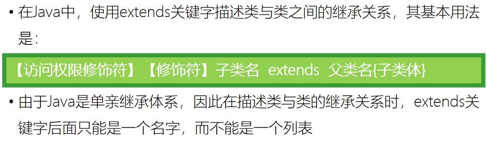

# 第9天 面向对象

## 主要内容

1、掌握static关键字的使用

2、掌握单例模式的使用

3、掌握类的继承与方法的覆盖

4、掌握super关键字的使用

5、掌握final关键字的使用

6、掌握抽象类的使用

7、掌握接口的使用

## 学习目标

| 节数   | 知识点                   | 要求 |
|--------|--------------------------|------|
| 第一节 | 掌握static关键字的使用   | 掌握 |
| 第二节 | 掌握单例模式的使用       | 掌握 |
| 第三节 | 掌握类的继承与方法的覆盖 | 掌握 |
| 第四节 | 掌握super关键字的使用    | 掌握 |
| 第五节 | 掌握final关键字的使用    | 掌握 |
| 第六节 | 掌握抽象类的使用         | 掌握 |
| 第七节 | 掌握接口的使用           | 掌握 |

## 掌握static关键字的使用

1.1静态代码块的定义

1.2静态代码块的执行时机

静态代码块在类被加载的时候就运行了，而且只运行一次，并且优先于各种代码块以及构造函数。如果一个类中有多个静态代码块，就会按照书写的顺序执行。

1.3静态代码块的作用

一般情况下，如果有些代码需要在项目启动的时候执行，这时就需要静态代码快，比如一个项目启动需要加载很多配置文件等资源，就可以都放在静态代码块中。

1.4静态代码块不能存在于任何方法体中

(1)对于普通方法，由于普通方法是通过加载类，然后new出实例化对象，通过对象才能运行这个方法，而静态代码块只需要加载类之后就能运行了。

(2)对于静态方法，在类加载的时候，静态方法就已经加载了，但是我们必须通过类名或者对象名才能进行访问，也就是说相对于静态代码块，静态代码块是主动运行的，而静态方法是被动运行的。

(3)不管哪种方法，我们需要明确的是静态代码块的存在在类加载的时候就自动运行了，而放在不管是普通方法中还是静态方法中，都是不能自动运行的。

3.4静态代码块不能访问普通代变量

1.  这个理解思维同上，普通代码块只能通过对象来进行 调用，而不能防砸静态代码块中。

1.5静态代码块的使用

static代码块和构造代码块同时出现时优先级

静态代码块\>构造代码块\>构造方法

### 本节作业

1.  静态代码块的定义

2.静态代码块的特点

## 掌握单例模式的使用

### 2.1 什么是单例模式

单例模式，是一种常用的软件设计模式。在它的核心结构中只包含一个被称为单例的特殊类。通过单例模式可以保证系统中，应用该模式的类一个类只有一个实例。即一个类只有一个对象实例。单例模式是设计模式中最简单的形式之一。这一模式的目的是使得类的一个对象成为系统中的唯一实例。要实现这一点，可以从客户端对其进行实例化开始。因此需要用一种只允许生成对象类的唯一实例的机制，“阻止”所有想要生成对象的访问。

### 2.2 懒汉式

## 掌握类的继承与方法的覆盖

3.1 **继承的意义**

**  
** 3.2 **继承的作用**

3.3 **extends关键字**

### 本节作业

1.**继承概念**

2.**继承作用**

3.extends关键字

## 掌握super关键字的使用

**4.1super()调用父类构造器**

### 本节作业

1.  **super调用父类构造器**
2.  **super有参无参构造器**

## 掌握final关键字的使用

在Java中，final关键字有最终的，不可修改的含义。

final关键字有三种用途，可以分别应用于变量、成员方法和类。

### 5.1 变量修饰为final

### 5.2 方法修饰为final

### 5.3 类修饰为final

### 5.4 注意final修饰的变量都能在哪里赋值

### 被final修饰的变量，有三种赋值方式。

### 被final static 修饰的变量，有两种赋值方式。

### 本节作业

1.  理解final
2.  final修饰类、修饰方法、修饰变量的特点
3.  final修饰数组、类类型变量的特点
4.  注意final修饰的变量都能在哪里赋值

## 掌握抽象类的使用

### 6.1 抽象类的定义

### 6.2 抽象方法的定义

### 6.3 抽象类和抽象方法的特点

6.4向对象的三大特征

也有四大特征的说法，那就是再多加一个抽象

### 本节作业

1.  理解抽象类

2\. 理解抽象方法

3\. 理解抽象类的特点

## 掌握接口的使用

在Java中，final关键字有最终的，不可修改的含义。

final关键字有三种用途，可以分别应用于变量、成员方法和类。7.1接口的概念

7.2 接口的定义

7.3接口的实现implements

### 7.4接口的特点

